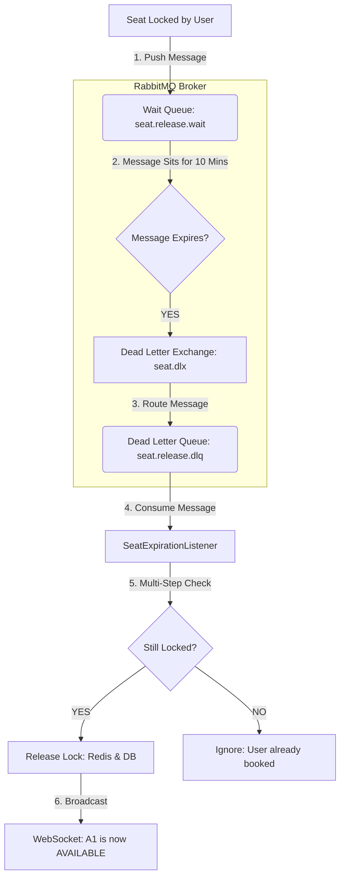

# 🏗️ Booking System Architecture Diagrams

This document explains the two core high-concurrency flows in the BookMyShow Scalable Demo.

---

## 1. Two-Tier Locking Flow (The "Fast-Hold" Pattern)
This flow ensures that the system is lightning-fast for thousands of concurrent users while still being 100% accurate at the database level.

```mermaid
sequenceDiagram
    autonumber
    participant User as React Frontend
    participant Backend as Spring Boot API
    participant Cache as Redis (SETNX)
    participant DB as MySQL (Optimistic Lock)
    participant WS as WebSocket Broker

    User->>Backend: POST /api/shows/{id}/hold (Seat A1)
    
    rect rgb(30, 30, 45)
    Note over Backend, Cache: Tier 1: Distributed Cache Lock
    Backend->>Cache: SET seat:101:A1 LOCKED (NX, EX 600s)
    Cache-->>Backend: OK (Success) or ERROR (Already Locked)
    end

    alt Lock Successful
        Backend->>WS: Broadcast: A1 is LOCKED
        WS-->>User: (All Users) A1 turns GREY
        Backend-->>User: HTTP 200: "Seat Held"

        Note over User, DB: User clicks 'Confirm Selection'
        User->>Backend: POST /api/shows/{id}/confirm
        
        rect rgb(45, 30, 30)
        Note over Backend, DB: Tier 2: Database Optimistic Lock
        Backend->>DB: UPDATE seats SET status=BOOKED, version=v+1 WHERE id=? AND version=v
        DB-->>Backend: Success (Rows=1)
        end
        
        Backend->>Cache: DEL seat:101:A1
        Backend->>WS: Broadcast: A1 is SOLD
        WS-->>User: (All Users) A1 turns RED
        Backend-->>User: HTTP 200: "Booking Guaranteed"
    else Lock Failed
        Backend-->>User: HTTP 409: "Seat already taken"
    end
```

### Why this is Scalable:
*   **Redis** handles the millions of "clicks" so the database doesn't crash from too many connections.
*   **MySQL** only performs the expensive "write" once the user is actually ready to pay.
*   **Optimistic Locking** ensures that even if two users somehow bypassed the Redis layer, only **one** transaction will succeed at the database level.

---

## 2. RabbitMQ Seat Expiration Flow (The "DLX" Pattern)
Instead of a scheduler running every minute (which is slow), we use RabbitMQ as a specialized "Timer."

### Key Components:
- **Wait Queue (`seat.release.wait`)**: This queue has NO consumers. Messages just sit there until their **TTL** (Time-To-Live) runs out.
- **Dead Letter Exchange (DLX)**: Acts as the "Wake Up" mechanism. It catches the messages that "died" in the Wait Queue and sends them to the processing queue.
- **Statelessness**: The Spring Boot server doesn't need to track timers in its memory. RabbitMQ handles all the timing, allowing you to scale the backend to 100+ instances without issues.

---

## Summary of Tech Roles
- **Redis**: The "Traffic Cop" (Real-time speed).
- **MySQL**: The "Vault" (Permanent accuracy).
- **RabbitMQ**: The "Timer" (Garbage collection of expired locks).
- **WebSockets**: The "Broadcaster" (Keeps everyone in sync).
